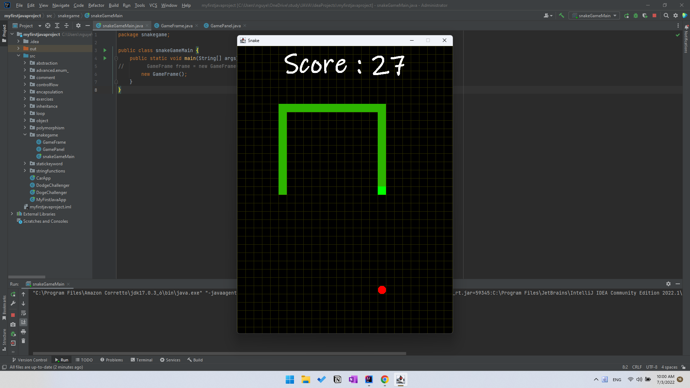

# snakeGame
snakeGame in Java  
Get fun and create yourself the legendary snakeGame with Java.

# tutorial by Brocode
https://www.youtube.com/watch?v=bI6e6qjJ8JQ  
I followed this tutorial and just make some tiny optimizations.

# demo 

https://www.youtube.com/shorts/gmU_C7XIG_E  

*recommended course to learn the basics of Java : https://ascend.udemy.com/course/practical-java-course  
but you can take any course to learn.  
Java is highly intuitive and object oriented so every thing can start with something.something ^_*
